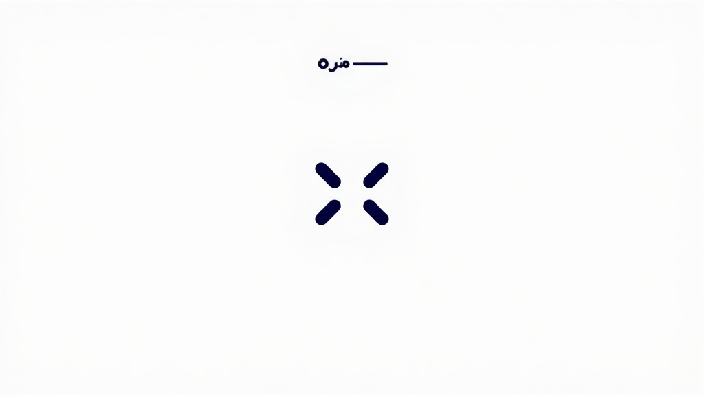
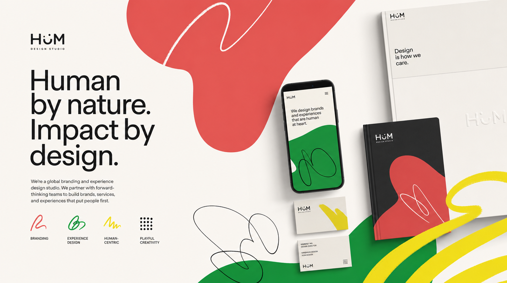
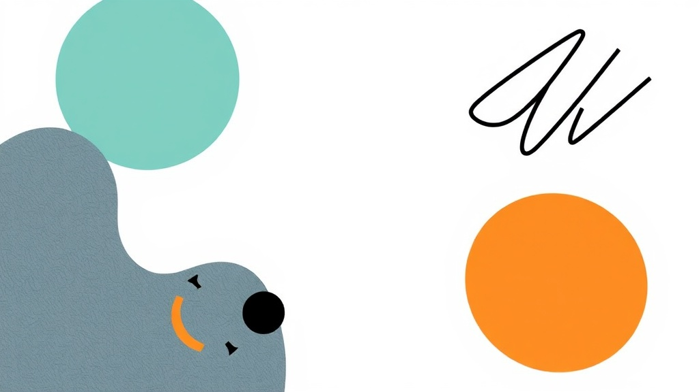
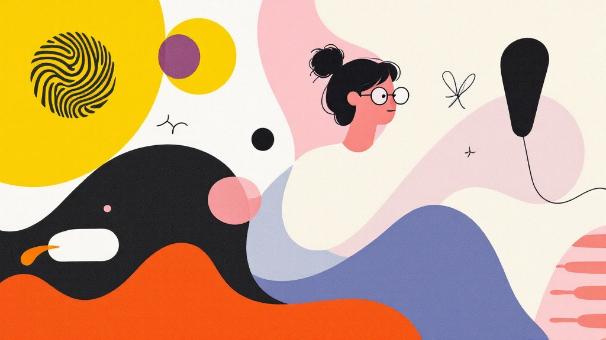
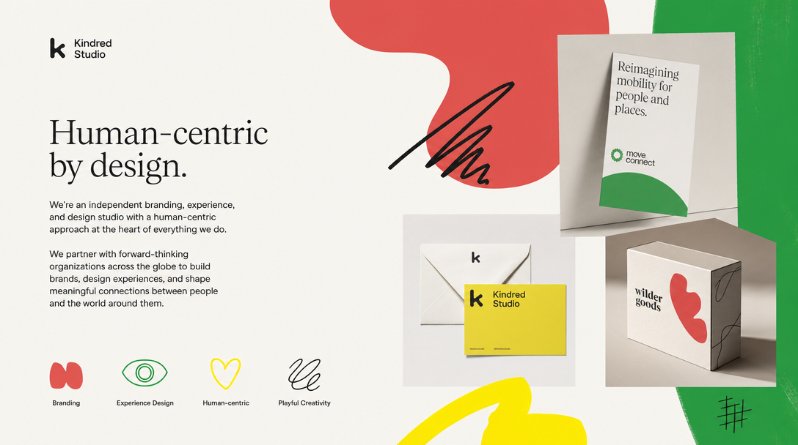
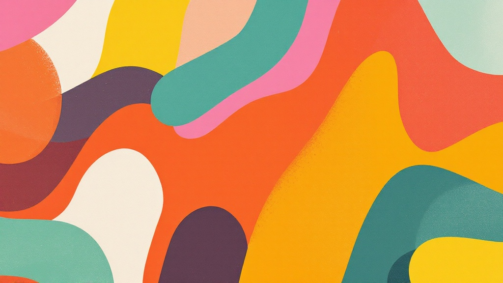
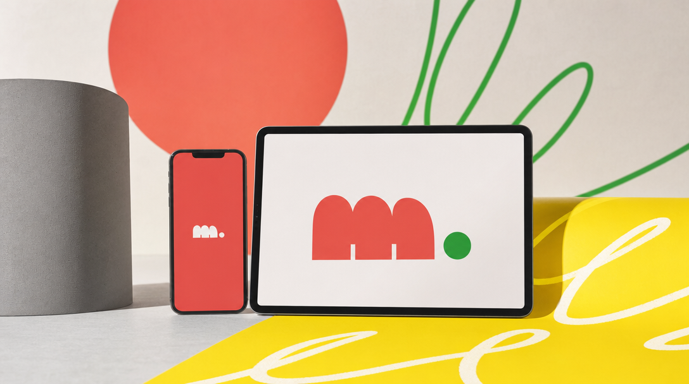
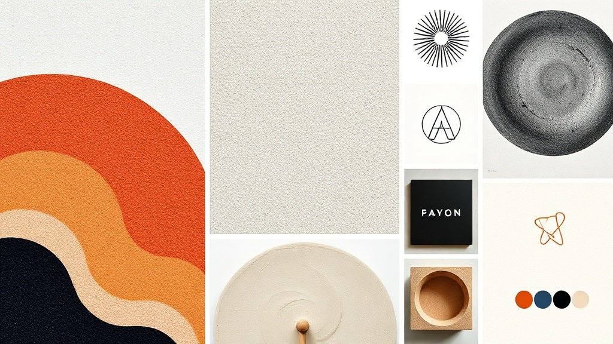
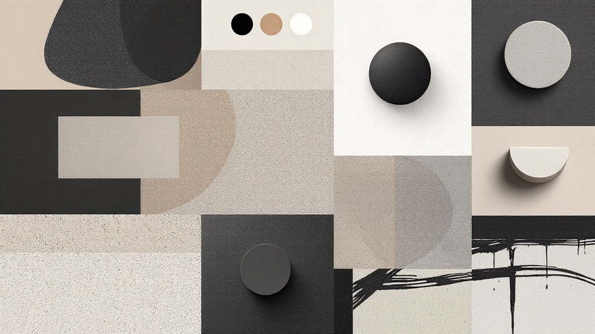
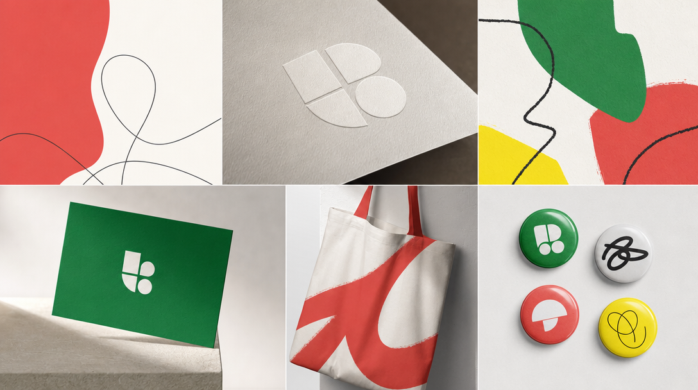

# Image benchmark — brand: My brand (BIO v9)

- hero-kv · flux-schnell:  — est $0.003
- hero-kv · flux-1.1-pro:  — est $0.04
- hero-kv · gpt-image-2:  — est $0.07

- editorial · flux-schnell:  — est $0.003
- editorial · flux-1.1-pro:  — est $0.04
- editorial · gpt-image-2:  — est $0.07

- ad-creative · flux-schnell:  — est $0.003
- ad-creative · flux-1.1-pro:  — est $0.04
- ad-creative · gpt-image-2:  — est $0.07

- moodboard-tile · flux-schnell:  — est $0.003
- moodboard-tile · flux-1.1-pro:  — est $0.04
- moodboard-tile · gpt-image-2:  — est $0.07

## Prompt basis
Same composed prompt per slot across both models.
